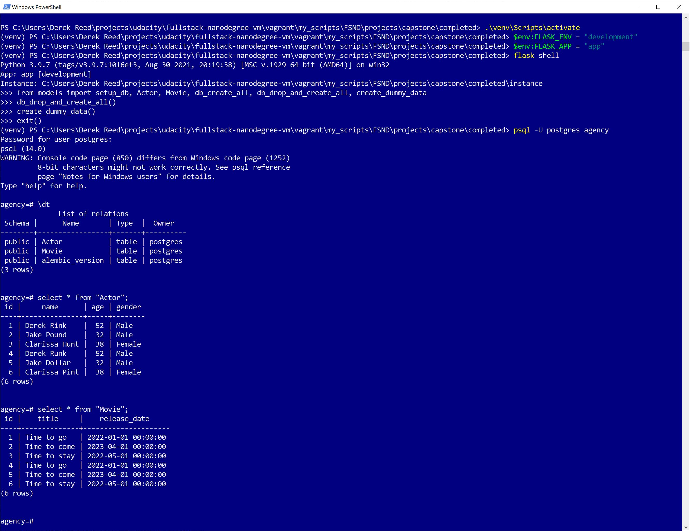
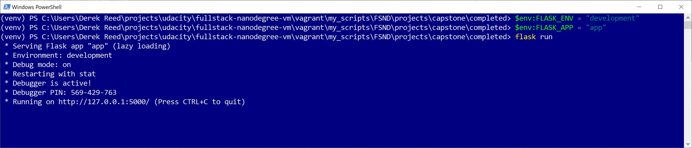
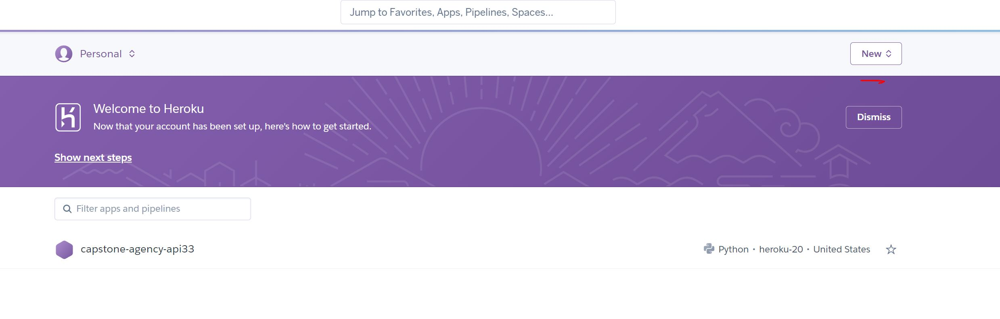
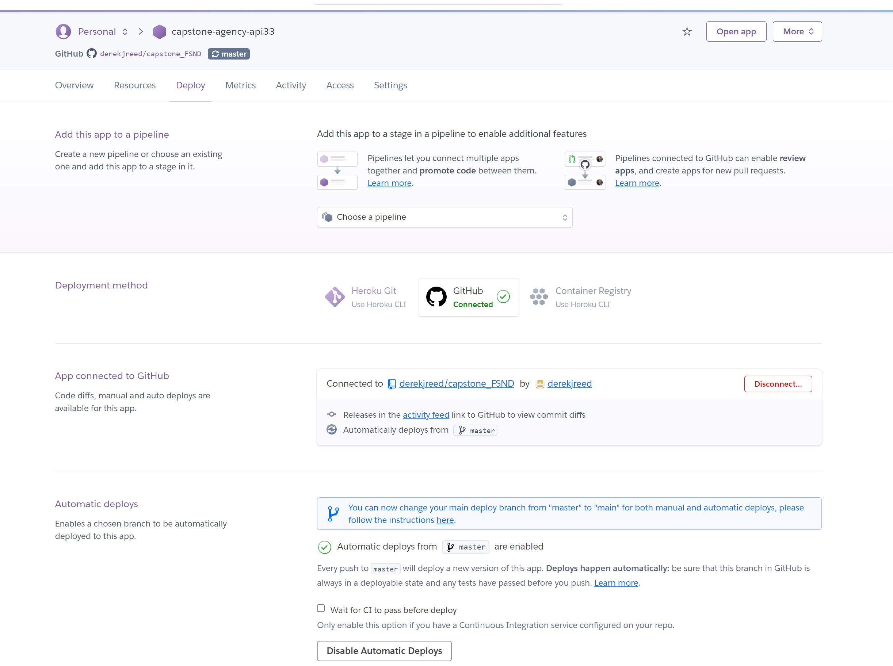
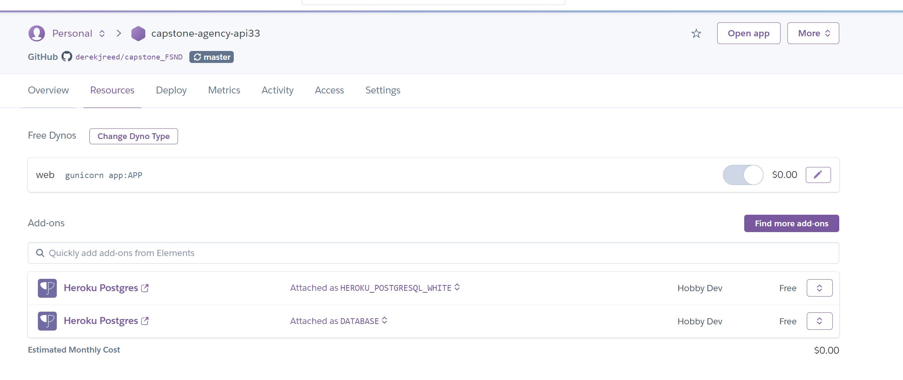
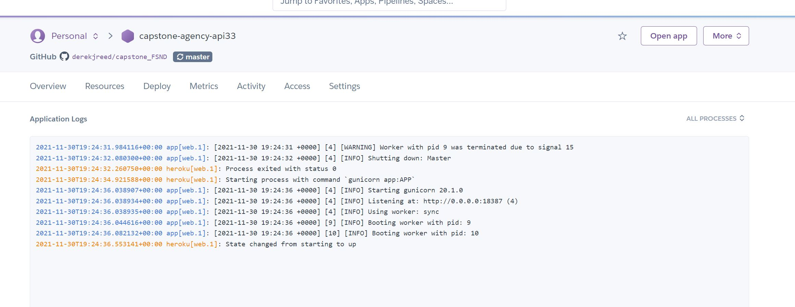

## Content

Hosted on [capstone-agency-api33](https://capstone-agency-api33.herokuapp.com/)

1. [Project Motivation](#proj-ref)
2. [Clone Git Repo](#git-ref)
3. [Setting Up and Configuring Python](#python-ref)
3. [Setting Up and Configuring the Database](#db-ref)
4. [How to Start Up a Standalone App](#standalone-ref)
5. [How to Deploy in Heroku](#heroku-ref)
6. [Authentication and authorisation](#auth-ref)
7. [API Reference](#api-ref)
8. [Acknowledgements](#ack-ref)


<a name="proj-ref"></a>
## Project Motivation
The project is the fifth and final project which 'caps' off all the work I have covered in the Full Stack Web developer 
Udacity Nano-degree. The course covers:
- Database design and usage
- Web Application design using CRUD
- Creating API's using Flask
- API testing and documentation
- Authorisation and authentication
- Kubernetes, containerisation and cloud deployment
- Putting this all together from scratch in a capstone project

The final project is based around an acting agency which looks after actors and finds roles in movies. The goal
was to create a database of actors and movies and to be able to use ***GET/DELETE/POST*** and ***PATCH*** API's to access and manipulate
the data via HTTP. The ficticious agency has a hierarchy of 3 users, each with varying and increasing access. This access
is controlled via Json Web Tokens (JWT) which have permission claims attached to them. Whilst creating the database, the API's
and setting up the Authentcation and authentcated users, testing scripts were devised and written to test the application; through
both the python unittest library and Postman. Finally the application was deployed in Heroku where final testing was carried out,
before the documentation was produced to allow others to look over this work.

<a name="git-ref"></a>
## Clone Git Repo

Firstly clone the repo using [this link](https://docs.github.com/en/repositories/creating-and-managing-repositories/cloning-a-repository)

<a name="python-ref"></a>
## Setting Up and Configuring Python

It is best to segregate your python environment using virtual environments

__Using a Linux shell and windows powershell__
```bash
pip install virtualenv
python3 -m venv env
source env/bin/activate

with windows
.\env\Script\activate
```


<a name="db-ref"></a>
## Setting Up and Configuring the Database

Certain database variables can be setup in the shell where you execute the flask application, these can be found in models.py. Below is an example setup
using the default values setout in models.py. Doing this allows you to more securely use sensitive data without exposing it to 'the world'.

```bash
export DB_HOST='127.0.0.1:5432')
export DB_USER='postgres')
export DB_PASSWORD='password123')
export DB_NAME='agency')
````

To set the database up first create the database for this app using postgresql commands dropdb and createdb. ***N.B the example is using
the Linux Bash shell, the database user is postgres and the database is called agency***

```bash
dropdb -U postgres agency
createdb -U postgres agency
```


There are a few files which are used to setup and model the data in the database.
- models.py this python library is used to setup the postgresql database and also contains some 'helper' functions to drop and create the
database tables and to create dummy data to test against. These helper functions include:
  - __db_create_all()__ - This will create the Actor and Movietables in the agency database
  - __db_drop_and_create_all()__ - This will drop and create the database tables and setup the datatypes for each column
  - __create_dummy_data()__ - This will create dummy data for testing

- setup.sh this is a bash script which can be used once the database has been created as setout above.

```bash
bash setup.sh
```

Else on windows, after setting up you python environment, you can open powershell in the repo's root dir and run

```bash
$env:FLASK_ENV = "development"
$env:FLASK_APP = "app"
flask shell
from models import setup_db, Actor, Movie, db_create_all, db_drop_and_create_all, create_dummy_data
db_drop_and_create_all()
create_dummy_data()
```

Below shows the creation of the tables and dummy data in powershell



<a name="standalone-ref"></a>
## How to Start Up a Standalone App

First setup your python environment, make sure you are in the root of the repo, where the app.py is and then run

```bash
export FLASK_ENV="development"
export FLASK_APP="app"
flask run
```

On windows, you can run the flask app using powershell as below




<a name="heroku-ref"></a>
## How to Deploy in Heroku

The steps for deploying to Heroku are:
- Create a flask app and push to a gitHub repo
- Make sure the requirements.txt is upto date with your app environment
- Create a Procfile which contains ***web: gunicorn app:APP*** push to repo
    - web is the Heroku process
    - gunicorn is the wsgi webserver you want to run
    - app is the name of the file containing the app (app.py)
    - APP is the app in the app.py file
- Login to Heroku and create a new app (press new button) 

- Configure Heroku to pull the gitHub repo (and manually pull to start the process) 

- Create a Postgresql database (the full connection strng is created including a random name for the database) 

- Look in the Settings > ConfigVars to find the DATABASE_URL and use this for the DB_PATH in models.py

- In the More > Run console run bash setup.sh. This will create the databse tables and populate the database with data  

- Check in More > View Logs to see what state the Application is in 

- When the application is up test using Postman and valid JWTs


<a name="auth-ref"></a>
## Authentication and authorisation

The Authentication and authorisation was configured through a third party site [Auth0](https://auth0.com/). The site allows for a login facility to create a JWT with approval claims which can then be used by the application once configured. The Authentication and authorisation config is setup in auth.py and is then utilised in app.py using ***@requires_auth()*** and the payload passed into the function representing each API endpoint. The project involves 3 separate authorisation levels (roles). These are divided by which API's they can access. The
approval claims are found in the payload of the JWT. The roles are and their associated approval claims are:

### Casting Assistant
- Can view actors and movies

```bash
"permissions": [
"get:actors",
"get:movies"
]
```

### Casting Director
- All permissions a Casting Assistant has and…
- Add or delete an actor from the database
- Modify actors or movies

```bash
"permissions": [
"delete:actors",
"get:actors",
"get:movies",
"patch:actors",
"patch:movies",
"post:actors"
]
```

### Executive Producer
- All permissions a Casting Director has and…
- Add or delete a movie from the database

```bash
"permissions": [
"delete:actors",
"delete:movies",
"get:actors",
"get:movies",
"patch:actors",
"patch:movies",
"post:actors",
"post:movies"
]
```


<a name="api-ref"></a>
## API Reference


### `GET /actors  - Retrieve actors from the database`
### `Parameters: None`

#### `Curl`
```bash
localhost
curl -s -H "Authorization: ${TOKEN}" -X GET http://127.0.0.1:5000/actors

heroku
curl -s -H "Authorization: ${TOKEN}" -X GET https://capstone-agency-api33.herokuapp.com/actors
```
Get request response returns a json payload containing
- actors - a list of dictionaries
- each dictionary contains:
    - age - an integer
    - gender - a string
    - id - an integer
    - name - a string

- success - a boolean
- total_actors - an integer


#### `Response Header`
```json
{
  "actors": [
    {
      "age": 52,
      "gender": "Male",
      "id": 1,
      "name": "Derek Rink"
    },
    {
      "age": 32,
      "gender": "Male",
      "id": 2,
      "name": "Jake Pound"
    }
  ],
  "success": true,
  "total_actors": 2
}

```
__Note:__ The output for GET with multiple records is paginated (5 records per page). To GET each page use the query URL parameter to view pages (e.g. ?page=integer)
#### `Page query`
```bash
curl -s -H "Authorization: ${EXECUTIVE_PRODUCE}" -X GET https://capstone-agency-api33.herokuapp.com/actors?page=2
{
  "actors": [
    {
      "age": 40,
      "gender": "Male",
      "id": 8,
      "name": "Joe Bloggs"
    },
    {
      "age": 40,
      "gender": "Male",
      "id": 9,
      "name": "Joe Bloggs"
    }
  ],
  "success": true,
  "total_actors": 7
}


```


<a name="api-ref"></a>
### `GET /actors/<int:actor_id>  - Retrieve actor_id from the database`
### `Parameters: actor_id`

#### `Curl`
```bash
localhost
curl -s -H "Authorization: ${TOKEN}" -X GET http://127.0.0.1:5000/actors/1

heroku
curl -s -H "Authorization: ${TOKEN}" -X GET https://capstone-agency-api33.herokuapp.com/actors/1
```
Get request response returns a json payload containing
- a single dictionary instance
- the dictionary contains:
    - age - an integer
    - gender - a string
    - id - an integer
    - name - a string
- success - a boolean
- total_actors - an integer


#### `Response Header`
```json
{
  "actor": {
    "age": 39,
    "gender": "Male",
    "id": 1,
    "name": "Joe James Bloggs"
  },
  "success": true
}


```

### `DELETE /actors/<int:actor_id>  - Delete actor_id from the database`
### `Parameters: actor_id`

#### `Curl`
```bash
localhost
curl -s -H "Authorization: ${TOKEN}" -X DELETE http://127.0.0.1:5000/actors/5

heroku
curl -s -H "Authorization: ${TOKEN}" -X DELETE https://capstone-agency-api33.herokuapp.com/actors/5
```
Delete request response returns a json payload containing
- a single dictionary instance
- the dictionary contains:
    - deleted - an integer
    - success - a boolean


#### `Response Header`
```json
{
  "deleted": 5,
  "success": true
}


```

### `POST /actors  - Creates a new actor in the database`
### `Parameters: None`

#### `Curl`
```bash
localhost
curl -s -H "Authorization: ${TOKEN}" -H "Content-Type: application/json" -d '{"name": "Joe Bloggs", "age": 40, "gender": "Male"}' -X POST http://127.0.0.1:5000/actors

heroku
curl -s -H "Authorization: ${TOKEN}" -H "Content-Type: application/json" -d '{"name": "Joe Bloggs", "age": 40, "gender": "Male"}' -X POST https://capstone-agency-api33.herokuapp.com/actors
```
Post request response returns a json payload containing
- actors - a list of dictionaries
- each dictionary contains:
    - age - an integer
    - gender - a string
    - id - an integer
    - name - a string
- created - an integer
- success - a boolean
- total_actors - an integer


#### `Response Header`
```json
{
  "actors": [
    {
      "age": 39,
      "gender": "Male",
      "id": 1,
      "name": "Joe James Bloggs"
    },
    {
      "age": 32,
      "gender": "Male",
      "id": 2,
      "name": "Jake Pound"
    },
    {
      "age": 38,
      "gender": "Female",
      "id": 3,
      "name": "Clarissa Hunt"
    },
    {
      "age": 38,
      "gender": "Female",
      "id": 6,
      "name": "Clarissa Pint"
    },
    {
      "age": 40,
      "gender": "Male",
      "id": 7,
      "name": "Joe Bloggs"
    }
  ],
  "created": 9,
  "success": true,
  "total_actors": 7
}


```

#### `Created actor`
```bash
curl -s -H "Authorization: ${TOKEN}" -X GET https://capstone-agency-api33.herokuapp.com/actors/9
{
  "actor": {
    "age": 40,
    "gender": "Male",
    "id": 9,
    "name": "Joe Bloggs"
  },
  "success": true
}


```

### `PATCH /actors/<int:actor_id>  - Update an actor in the database`
### `Parameters: actor_id`

#### `Curl`
```bash
localhost
curl -s -H "Authorization: ${TOKEN}" -H "Content-Type: application/json" -d '{"name": "James Dean"}' -X PATCH http://127.0.0.1:5000/actors/1

heroku
curl -s -H "Authorization: ${TOKEN}" -H "Content-Type: application/json" -d '{"name": "James Dean"}' -X PATCH https://capstone-agency-api33.herokuapp.com/actors/1
```
Patch request response returns a json payload containing
- actors - a list of dictionaries
- each dictionary contains:
    - age - an integer
    - gender - a string
    - id - an integer
    - name - a string
- success - a boolean
- total_actors - an integer


#### `Response Header`
```json
{
  "actors": [
    {
      "age": 39,
      "gender": "Male",
      "id": 1,
      "name": "James Dean"
    },
    {
      "age": 32,
      "gender": "Male",
      "id": 2,
      "name": "Jake Pound"
    },
    {
      "age": 38,
      "gender": "Female",
      "id": 3,
      "name": "Clarissa Hunt"
    },
    {
      "age": 38,
      "gender": "Female",
      "id": 6,
      "name": "Clarissa Pint"
    },
    {
      "age": 40,
      "gender": "Male",
      "id": 7,
      "name": "Joe Bloggs"
    }
  ],
  "success": true,
  "total_actors": 7
}


```


### `GET /movies  - Retrieve movies from the database`
### `Parameters: None`

#### `Curl`
```bash
localhost
curl -s -H "Authorization: ${TOKEN}" -X GET http://127.0.0.1:5000/movies

heroku
curl -s -H "Authorization: ${TOKEN}" -X GET https://capstone-agency-api33.herokuapp.com/movies
```
Get request response returns a json payload containing
- movies - a list of dictionaries
- each dictionary contains:   
    - id - an integer
    - release_date - a datetime obj
    - title - a string
- success - a boolean
- total_movies - an integer


#### `Response Header`
```json
{
  "movies": [
    {
      "id": 1,
      "release_date": "Sat, 01 Jan 2022 00:00:00 GMT",
      "title": "Gums"
    },
    {
      "id": 2,
      "release_date": "Sat, 01 Apr 2023 00:00:00 GMT",
      "title": "Time to come"
    },
    {
      "id": 3,
      "release_date": "Sun, 01 May 2022 00:00:00 GMT",
      "title": "Time to stay"
    },
    {
      "id": 5,
      "release_date": "Sat, 01 Apr 2023 00:00:00 GMT",
      "title": "Time to come"
    },
    {
      "id": 6,
      "release_date": "Sun, 01 May 2022 00:00:00 GMT",
      "title": "Time to stay"
    }
  ],
  "success": true,
  "total_movies": 6
}


```

__Note:__ The output for GET with multiple records is paginated (5 records per page). To GET each page use the query URL parameter to view pages (e.g. ?page=integer)
#### `Page query`
```bash
curl -s -H "Authorization: ${EXECUTIVE_PRODUCE}" -X GET https://capstone-agency-api33.herokuapp.com/movies?page=2
{
  "movies": [
    {
      "id": 7,
      "release_date": "Sun, 01 May 2022 00:00:00 GMT",
      "title": "To be a genius"
    },
    {
      "id": 8,
      "release_date": "Thu, 03 Mar 2022 00:00:00 GMT",
      "title": "This will work"
    }
  ],
  "success": true,
  "total_movies": 7
}

```

### `GET /movies/<int:movie_id>  - Retrieve movie_id from the database`
### `Parameters: movie_id`

#### `Curl`
```bash
localhost
curl -s -H "Authorization: ${TOKEN}" -X GET http://127.0.0.1:5000/movies/1

heroku
curl -s -H "Authorization: ${TOKEN}" -X GET https://capstone-agency-api33.herokuapp.com/movies/1
```
Get request response returns a json payload containing
- a single dictionary instance
- the dictionary contains:
    - id - an integer
    - release_date - a datetime obj
    - title - a string
- success - a boolean
- total_movies - an integer


#### `Response Header`
```json
{
  "actor": {
    "age": 39,
    "gender": "Male",
    "id": 1,
    "name": "Joe James Bloggs"
  },
  "success": true
}


```

### `DELETE /movies/<int:movie_id>  - Delete movie_id from the database`
### `Parameters: movie_id`

#### `Curl`
```bash
localhost
curl -s -H "Authorization: ${TOKEN}" -X DELETE http://127.0.0.1:5000/movies/5

heroku
curl -s -H "Authorization: ${TOKEN}" -X DELETE https://capstone-agency-api33.herokuapp.com/movies/5
```
Delete request response returns a json payload containing
- a single dictionary instance
- the dictionary contains:
    - deleted - an integer
    - success - a boolean


#### `Response Header`
```json
{
  "deleted": 5,
  "success": true
}


```

### `POST /movies  - Creates a new movie in the database`
### `Parameters: None`

#### `Curl`
```bash
localhost
curl -s -H "Authorization: ${TOKEN}" -H "Content-Type: application/json" -d '{"title": "This will work", "release_date": "2022-03-03"}' -X POST http://127.0.0.1:5000/movies

heroku
curl -s -H "Authorization: ${TOKEN}" -H "Content-Type: application/json" -d '{"title": "This will work", "release_date": "2022-03-03"}' -X POST https://capstone-agency-api33.herokuapp.com/movies
```
Post request response returns a json payload containing
- movies - a list of dictionaries
- each dictionary contains:   
    - id - an integer
    - release_date - a datetime obj
    - title - a string
- created - an integer
- success - a boolean
- total_movies - an integer


#### `Response Header`
```json
{
  "movies": [
    {
      "id": 1,
      "release_date": "Sat, 01 Jan 2022 00:00:00 GMT",
      "title": "Gums"
    },
    {
      "id": 2,
      "release_date": "Sat, 01 Apr 2023 00:00:00 GMT",
      "title": "Time to come"
    },
    {
      "id": 3,
      "release_date": "Sun, 01 May 2022 00:00:00 GMT",
      "title": "Time to stay"
    },
    {
      "id": 5,
      "release_date": "Sat, 01 Apr 2023 00:00:00 GMT",
      "title": "Time to come"
    },
    {
      "id": 6,
      "release_date": "Sun, 01 May 2022 00:00:00 GMT",
      "title": "Time to stay"
    }
  ],
  "created": 8,
  "success": true,
  "total_movies": 7
}


```

#### `Created movie`
```bash
curl -s -H "Authorization: ${EXECUTIVE_PRODUCE}" -X GET https://capstone-agency-api33.herokuapp.com/movies/8
{
  "movie": {
    "id": 8,
    "release_date": "Thu, 03 Mar 2022 00:00:00 GMT",
    "title": "This will work"
  },
  "success": true
}


```


### `POST /movies  - Creates a new movie in the database`
### `Parameters: None`

#### `Curl`
```bash
localhost
curl -s -H "Authorization: ${TOKEN}" -H "Content-Type: application/json" -d '{"title": "This will work better"}' -X PATCH http://127.0.0.1:5000/movies/1

heroku
curl -s -H "Authorization: ${TOKEN}" -H "Content-Type: application/json" -d '{"title": "This will work better"}' -X PATCH https://capstone-agency-api33.herokuapp.com/movies/1
```
Post request response returns a json payload containing
- movies - a list of dictionaries
- each dictionary contains:   
    - id - an integer
    - release_date - a datetime obj
    - title - a string
- created - an integer
- success - a boolean
- total_movies - an integer


#### `Response Header`
```json
{
  "movies": [
    {
      "id": 1,
      "release_date": "Sat, 01 Jan 2022 00:00:00 GMT",
      "title": "This will work better"
    },
    {
      "id": 2,
      "release_date": "Sat, 01 Apr 2023 00:00:00 GMT",
      "title": "Time to come"
    },
    {
      "id": 3,
      "release_date": "Sun, 01 May 2022 00:00:00 GMT",
      "title": "Time to stay"
    },
    {
      "id": 5,
      "release_date": "Sat, 01 Apr 2023 00:00:00 GMT",
      "title": "Time to come"
    },
    {
      "id": 6,
      "release_date": "Sun, 01 May 2022 00:00:00 GMT",
      "title": "Time to stay"
    }
  ],
  "success": true,
  "total_movies": 7
}


```


<a name="ack-ref"></a>
## Acknowledgements

I would like to thank all the people at Udacity especially the support guys for their hardwork and help. Miguel Grinberg for all the useful information
he has compiled for the flask community. Anthony Herbert at https://prettyprinted.com/ for all his youtube content which was very helpful
for this course. Finally, thank you to the opensource community for being open to giving stuff away for free...this is a great concept.